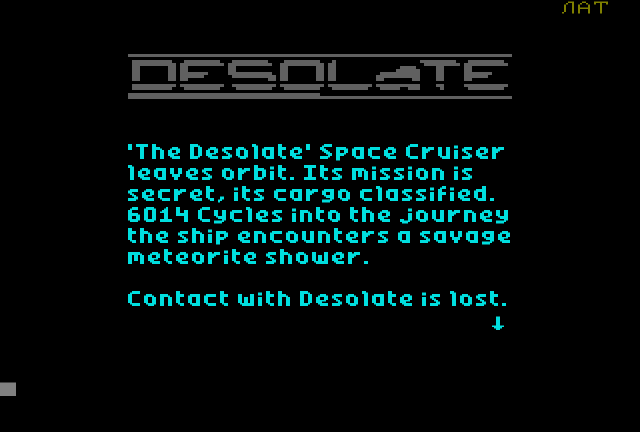
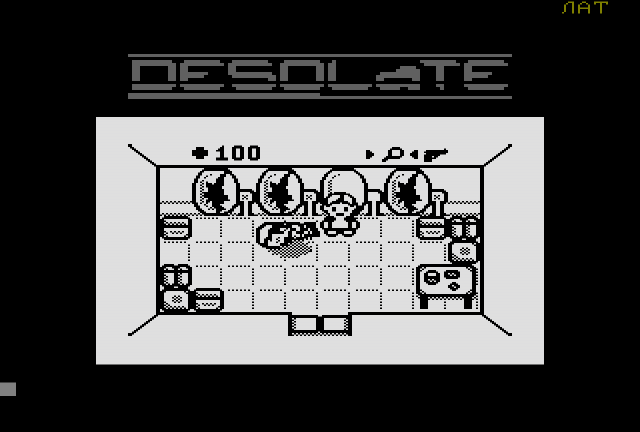

# uknc-desolate
Porting **Desolate** game from TI-83 Plus calculator to soviet computer [UKNC](https://en.wikipedia.org/wiki/UKNC) (УКНЦ).

Thanks a lot to tr1p1ea for the original game!
Thanks to [zx-pk.ru forum](https://zx-pk.ru/forum.php) members for all the help and support!

Porting status: work in progress.

The main challenge here is to convert ~4K lines of Z80 assembly code to PDP-11 MACRO assembler, in other words, to convert all the code to very different processor. Plus the usual stuff like different video and input.

## The original game

Written by Patrick Prendergast (tr1p1ea) for TI-83/TI-84 calculators.

Links:
 - [Desolate game description and files](https://www.ticalc.org/archives/files/fileinfo/348/34879.html)
 - [Wabbit emulator site](http://wabbitemu.org/) and [GitHub](https://github.com/sputt/wabbitemu)

To run the game on Wabbitemu emulator:
 1. Run Wabbitemu, select ROM file
 2. File Open `DesData.8xp`
 3. <kbd>MEM</kbd>, select Archive; <kbd>PRGM</kbd>, select DesData; <kbd>ENTER</kbd>
 4. File Open `Desolate.8xp`
 5. File Open `MIRAGEOS.8xk`
 6. <kbd>APPS</kbd> select MirageOS
 7. Select Main > Desolate

## Tools used to develop the port

 - [RT-11 simulator](http://emulator.pdp-11.org.ru/RT-11/distr/) written by Dmitry Patronov, to run RT-11 commands `MACRO` and `LINK` directly from the Windows command line
 - [UKNCBTL utilities](https://github.com/nzeemin/ukncbtl-utils): `rt11dsk` to work with disk images, `sav2cartridge` to prepare UKNC ROM cartridge
 - [pclink11](https://github.com/nzeemin/pclink11): to link object modules just like `LINK` command do, but mostly to test `pclink11`
 - VSCode as the primary code editor

 Emulators of the machine:
  - [UKNCBTL](https://github.com/nzeemin/ukncbtl)
  - [EmuStudio](https://zx-pk.ru/threads/18027-emulyator-uknts-emustudio.html)

## Links

 - [Desolate port on ZX Spectrum](https://github.com/nzeemin/spectrum-desolate)
 - [Desolate port on Vector06c](https://github.com/nzeemin/vector06c-desolate)

